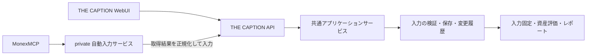

# ADR-0008: THE CAPTION API と private 自動入力サービスの分離

**Status: Proposed（段階Bの3画面API・WebUIを実装。汎用取込・private連携は設計段階）**

**作成日: 2026-09-08**

## Context

THE CAPTION は資産管理ツールとして、WebUI で行える操作をすべて API からも実行できるようにする。MonexMCP を利用する資産の自動入力は、別の private リポジトリで管理し、THE CAPTION API のクライアントとして実装する。これは利用者から指定された境界である。

本書はこの境界に沿った実装前の設計案である。エンドポイント名、追加データ構造、実装順は提案であり、既存機能の提供済み仕様を表すものではない。実口座へのアクセス、リポジトリ新設、定期実行の設定は行っていない。

2026-09-08追記: 段階Aの[API契約](../reference/api-v1.md)を作成し、段階Bの3リソースGET/PUT・認証・WebUI・共有ロックによる保存/日次読取り経路を実装した。汎用取込、private連携、実データ導入は後続段階。以下の「設計開始時の構造」は移行前の記録である。

### 設計開始時の構造

- React の WebUI は Market Units / External Assets / Portfolio Basis の3画面を持つ。行の追加・編集・削除は下書きであり、Save to Server でリソース全体を保存する。
- Express は3組の GET / POST と health の計7ルートを持ち、CSV / JSON を直接読み書きする。外部向けの認証・認可、更新競合検出、再送制御、変更履歴の契約はまだない。
- 市場連動資産は `data/collection/market_units.csv` の保有数量、現金・外部資産は `data/external_assets.json` の絶対額を計算元の正典とする。`data/portfolio_basis.json` は月別の総取得原価入力である。
- 日次の Market Units snapshot は同日の有効な既存ファイルを再利用し、上書きしない。現在の数量から過去日を埋めない。
- `docs/reference/system.md` の WebUI 説明には2画面の記述が残るため、本設計の操作一覧は現在の UI / server 実装を根拠とする。

現状の根拠: [App.tsx](../../src/web/market_units_editor/src/App.tsx)、[server.ts](../../src/web/market_units_editor/server.ts)、[UniversalIngester](../../src/domain/universal_ingester.py)、[Units snapshot](../../src/domain/market_units_snapshot.py)、[ADR-0004](./ADR-0004-collection-primary-v4.md)、[ADR-0006](./ADR-0006-market-units-snapshot-capture.md)。

## Decision

### 1. リポジトリと責務



| 所有する機能 | THE CAPTION | private 自動入力リポジトリ |
| :--- | :--- | :--- |
| 資産・保有数量・現金・取得原価の管理 | 所有 | API を使用 |
| WebUI と正式 API、入力検証、競合・再送制御 | 所有 | 公開契約に従う |
| 汎用の入力元ID、編集対象の権限、取込履歴 | 所有 | 自身の入力元IDを使用 |
| 資産評価、価格・為替取得、日次固定、レポート | 所有 | 確定値を直接変更しない |
| Monex 認証、MCP 接続、ページ取得、再認証 | 持たない | 所有 |
| Monex 銘柄コード・口座区分・数量単位の解釈 | 持たない | 所有 |
| Monex と THE CAPTION の銘柄対応表 | 持たない | 所有 |
| 取得予定、再試行、取得状況・失敗通知 | 持たない | 所有 |

private リポジトリ名は `the-caption-monex-importer` を仮称とする。コード、依存ライブラリ、CI、リリース、実行環境を別管理にし、THE CAPTION の Python module / 内部ファイル / DB を直接参照しない。依存するのはバージョン付き HTTP API とその公開 schema だけとする。THE CAPTION は private リポジトリを取得しなくてもビルド・テスト・起動できる。

MonexMCP は入力元であり、THE CAPTION API は入力先である。THE CAPTION 内に Monex 用の MCP client を組み込む必要はない。将来ほかの MCP client から THE CAPTION を操作するときは、同じ API を使う薄い汎用 MCP adapter を追加できるが、今回の必須成果には含めない。

### 2. API と WebUI の関係

正式 API を `/api/v1` とし、WebUI 自身もこの API を利用する。WebUI 専用の保存経路や検証を残さない。公開 OpenAPI を契約の正本とし、各画面操作に `operationId`・入力・出力・権限・失敗条件を対応付ける。

「すべて網羅」は、同じ権限で同じ入力を与えたとき、WebUI と API で保存結果・エラー・変更履歴が一致することを意味する。フォームを開く、Cancel、タブ切替など表示だけの操作は HTTP endpoint を増やさず、API が返すデータと schema から再現する。保存前に取り消せる下書きという WebUI の操作感は維持する。

| 現在の WebUI 操作 | 正式 API 案 | 契約に含める範囲 |
| :--- | :--- | :--- |
| Market Units 読込み・Refresh | `GET /api/v1/market-units` | 全項目、安定ID、revision、保存順 |
| 銘柄追加・編集・削除をまとめて保存 | `PUT /api/v1/market-units` | `name / asset_class / currency / units / source_symbol / audit_match_key / csv_url`。条件付き全置換、明示的な空配列も表現可能 |
| External Assets 読込み・Refresh | `GET /api/v1/external-assets` | `default` と全月、各項目の安定ID |
| 外部資産の追加・編集・削除・月移動・保存 | `PUT /api/v1/external-assets` | `category / amount / name`、旧月からの移動、最後の項目削除時の空月除去、明示的な全消去 |
| Portfolio Basis 読込み・Refresh | `GET /api/v1/portfolio-basis` | `default` と全月の `total_acquisition_cost_jpy` |
| 取得原価の追加・編集・削除・月キー変更・保存 | `PUT /api/v1/portfolio-basis` | 全月の条件付き保存。既存月への移動で置換する場合も入力に明記 |
| 月順表示・候補一覧・件数・入力制約 | 上記 GET と OpenAPI、`GET /api/v1/input-schema` | 月降順・default末尾、候補値と制約。カテゴリ候補を閉じた固定 enum と混同しない |

追加の汎用機能として、安定IDで対象を指定する `POST /api/v1/input-change-sets` を提供する。複数行の追加・更新・削除・月移動を、全体データの置換なしに一括適用できる。`GET /api/v1/health` は状態とバージョンだけを返し、内部ファイルの絶対パスを公開契約にしない。

全消去は API からも表現可能にするが、通常の行更新とは権限を分ける。Market Units が空の状態を保存できることと、日次計算が有効な snapshot を作れることは別契約である。空状態からの実行は既存の日次入力検証に従い、架空のゼロ資産レポートを生成しない。

レポート実行・ダウンロード・archive・設定画面は現在の WebUI にはないため、「既存 UI 対応済み」の範囲に数えない。今後 WebUI へ操作を追加する変更では、対応する API と契約検証も同時に追加する。

### 3. 本体の実装境界と互換性

正規の保存サービスは Python のアプリケーション層へ置き、既存 domain の検証・正規化を共有する構成を推奨する。Market Unitsの実装では既存ExpressをHTTP入口とし、private stdio接続のPython workerへ委譲する。配置と依存方向は [src の規約](../../src/AGENTS.md) と [ADR-0007](./ADR-0007-layer-separation-and-ports.md) に従う。

現在の Express は移行中の配信・互換 adapter として使用し、旧 `/api/funds` 等の書込みも同じ保存サービスへ委譲する。新 API の追加だけで旧無認証書込みを放置しない。WebUI の移行・互換検証後に旧経路を廃止する。

初期段階では既存 CSV / JSON の計算元契約を維持し、全面的な DB 移行は要求しない。汎用メタデータとして安定ID・入力元・管理対象・revision・変更履歴を本体側に追加する。

- API の `asset_id` / `entry_id` は不変IDとし、配列 index、名称、`month::index` を使用しない。既存 `audit_match_key` は互換識別子として維持し、編集可能な値をそのまま不変IDと見なさない。
- 移行でIDを発行し、既存行との対応を保存する。改名・月移動・並べ替えでもIDは変わらない。全置換 API は既存IDを受け取り、新規行だけに新IDを発行する。対応が曖昧な旧データは明示的な移行対象として扱う。
- WebUI にしかない検証を共通化する。非数値を `0` に変換する現行 server の挙動は正式 API に引き継がず、フィールド付きの検証エラーにする。
- 数量・金額は API では10進文字列とし、有限値・符号・単位・許容精度を schema で定める。内部計算への変換境界を明示し、NaN / Infinity / bool の数値化を認めない。
- External Assets は既存契約の JPY 絶対額とする。原通貨額をそのまま `amount` へ保存しない。Portfolio Basis は任意の月別集計値であり、一部口座の取得原価を総取得原価へ上書きしない。

複数ファイルの保存を単なる連続 rename で原子的と呼ばない。保存前後の内容・hash・revision・取込結果を持つ永続 journal と、API / 互換 writer / 日次 reader 共通のプロセス間 lock を使用する。lock 内で検証、journal 準備、各ファイル置換、読戻し、commit 記録を行う。途中停止時は次の読書き前に journal から前状態への復旧または commit 完了を行い、混在した状態を公開しない。commit 済み記録と再送結果も一緒に復旧できるようにする。

この共有保存・読取り経路への移行を自動反映の前提にする。既存の直接読取りを残したまま複数ファイルの一貫性を保証しない。運用中の外部手編集は hash 差分として検出し、未登録変更を自動上書きせず再取込を要求する。

### 4. 自動入力の汎用 API

通常編集の API に加え、外部入力の確認と反映を分ける。ここには Monex 固有の型・コードを持ち込まない。

| Endpoint 案 | 役割 |
| :--- | :--- |
| `GET/POST/PATCH /api/v1/input-sources[/{id}]` | 汎用の入力元名、有効状態、書込み可能な対象・項目を管理。owner権限が必要 |
| `POST /api/v1/import-batches` | 正規化済み入力を検証し、変更予定・対象外・競合を返す。資産入力はまだ変更しない |
| `GET /api/v1/import-batches/{id}` | 状態、diff、hash、元revision、結果revision、反映時刻を取得 |
| `POST /api/v1/import-batches/{id}/commit` | 確認した同一payloadを、同一対象revisionに一括反映 |
| `POST /api/v1/import-batches/{id}/cancel` | 未反映バッチを破棄扱いにする。確定済み履歴を削除しない |
| `GET /api/v1/input-changes` | 変更元・前後値・対象・反映結果を履歴として確認 |

取込バッチの最小契約は次とする。識別子・数量・日時は説明用の架空値である。

```json
{
  "schema_version": "caption.input.v1",
  "source_id": "src_example",
  "source_run_id": "run_example_001",
  "mapping_version": "3",
  "mode": "absolute_snapshot",
  "base_revision": "rev_42",
  "collected_at": "2026-09-08T18:30:00+09:00",
  "scope_id": "mapped-jp-positions",
  "enumeration_complete": true,
  "consistent_as_of": null,
  "items": [
    {
      "external_record_id": "opaque_record_1",
      "asset_id": "asset_example",
      "quantity": "123",
      "quantity_unit": "share",
      "as_of": null
    }
  ]
}
```

`collected_at` は取得時刻、`as_of` は入力元が示した残高の基準時点、`consistent_as_of` はバッチ全体に同一基準時点の根拠がある場合だけ設定する。取得時刻から基準日を捏造しない。基準時点不明の入力を自動反映できるかは入力元の鮮度方針で明示し、履歴復元には使用しない。

取込は差分加算でなく絶対数量の置換とする。同じ123株を二度取得して246株にしない。通常の差分表示は「100 → 123」のようにサーバーが作成する。

バッチ内の全対象が検証を通った場合だけ反映し、一部成功にはしない。初期の対象商品を国内株・米国株・対応済み投信に絞ることは可能だが、その対象範囲を先に設定する。実行途中に失敗した商品を黙って対象から外して全件成功にしない。

### 5. 識別・所有範囲・手入力との共存

private 側の対応表は、`接続口座のローカル識別子 + 商品種別 + 商品コード + 預り区分 + 必要な補助区分` から THE CAPTION の安定IDへ対応させる。投信では NISA 区分・分配方式も必要に応じて含める。名称だけの近似一致や LLM の推測で既存資産へ紐付けない。

- 初回は候補の差分を提示し、対応表と管理対象を明示的に登録する。一度設定した数量更新は、同じ対応・権限・条件を満たす限り毎回の確認を要しない。
- THE CAPTION の入力元設定は書込可能なIDと項目を制約する。private 側の対応表変更だけで、その範囲を拡張できない。
- 同一銘柄の複数預り区分を一つの THE CAPTION 行へ集約する場合は、合計対象の外部レコード集合を対応表で固定して合算する。全要素が取得済みであることを必要条件とする。
- 既存行が他社口座や手入力分も合算している場合、Monex 分だけで行全体を置換できない。入力単位を分割するか、全構成要素を明示するまではその行を自動管理対象にしない。
- 自動入力は既定で数量のみを更新する。表示名、分類、価格取得先、`csv_url`、取得原価、他の現金行を変更しない。新銘柄は価格ソースと単位を含めて登録されるまで `needs_mapping` とする。
- 自動管理中の数量を WebUI で手動変更した場合は、対象を `manual_override` として自動更新を休止する。所有者が解除して再確認した後に再開し、次の同期で無言で上書きしない。
- 日次の為替参照用 `FX` 行と、証券会社の FX 建玉・外貨現金は異なる。商品名の一致だけで対応させない。

### 6. 重複・競合・欠落の扱い

書込みには `Idempotency-Key` を必須とし、認証主体・操作・key と request hash を永続化する。同じ key / 同じ payload の再送は元の結果を返し、異なる payload は `409`。同一内容の再送判定は revision 再検証より先に行う。応答が失われても同じ key で確認・再送できる。

通常編集は `ETag / If-Match`、取込は `base_revision` と保存済みdiffのhashを用いる。反映直前に revision・権限・対応対象を再確認し、変更があれば `412` またはバッチの `conflict` として再確認へ戻す。部分更新は指定ID・指定項目だけに適用する。旧 UI、複数クライアント、日次との競合も同じ仕組みで扱う。

異なる run ID の古い入力も判定する。入力元・対象ごとの直近反映時点を保持し、古い基準時点は自動反映しない。同じ基準時点で値が異なる場合は訂正候補として扱う。時点不明なら private worker の単一起動と単調な取得順序を使うが、それを金融データの同時点保証とは呼ばない。

| 入力の状態 | 反映方針 |
| :--- | :--- |
| 明示された有効な数量0 | 対応済み対象を0へ更新可能。行・履歴は保持 |
| 一覧から消えた銘柄 | 初期運用では削除・0化せず `missing_position`。全件取得だけでは売却確定としない |
| null、取得不能、未対応商品、途中ページ失敗 | 未取得として停止。0や空の正常snapshotへ変換しない |
| 銘柄対応なし・単位不明・区分不明 | `needs_mapping` / `invalid_input`。推測して反映しない |
| 既存入力と同一 | `no_change`。新しい資産変更を作らない |
| 反映前に手入力・別バッチが更新 | `conflict`。再読込みして新しいdiffを作る |

将来、欠落を自動で0化する機能を追加する場合は、入力元が保証する全件性・時点・無保有表現と、管理範囲限定の消込方針を別途定義する。

### 7. MonexMCP adapter

2026-09-08 に接続中のツール定義を確認した。以下は schema と公式資料による確認であり、実口座応答の検証ではない。実行時は MCP の `tools/list` が返す正式名と schema を固定し、Codex 内の `mcp__codex_apps__app_*` 名をリモート wire 名として決め打ちしない。

| 入力元 | 初期の扱い | 注意点 |
| :--- | :--- | :--- |
| `app_get_account_summary` | 最初に取得し利用可能ツールを確認 | 買付余力は現金残高ではない |
| `app_get_jp_stock_positions` | 国内株の数量入力候補 | `quantity` は株数。預り区分を保持 |
| `app_get_us_stock_positions` | 米国株の数量入力候補 | USD市場価格とJPY取得単価を混同しない |
| `app_get_fund_positions` | 単位を確定した投信だけ入力候補 | full の通貨・表示単位口数等を確認。10000口を一律仮定しない |
| `app_get_precious_metal_positions` | 後続候補 | 重量gと既存価格ソースの単位変換を確認 |
| 香港株・債券・外貨MMF・ON COMPASS | 後続候補 | 本体の評価対応、安定銘柄ID、通貨・単位の確認が必要 |
| 信用・FX・先物オプション | 現物数量へ取り込まない | 方向、証拠金、契約倍率等の別モデルが必要 |
| 現金・外貨残高 | 初期の自動同期から除外 | 総合口座の独立した現金残高、外貨の原通貨額を現行summary schemaだけでは確定できない |

投信の表示単位口数は通常10000でも、1・1000やnullの場合がある。private 側は入力単位と THE CAPTION の価格単位を対応付ける。欠落単位を価格・評価額から逆算して補わない。コードのない商品は登録済みの一意な対応根拠がない限り保留する。

貴金属専用口座の現金残高を証券総合口座の現金へ転用しない。入出金履歴からは開始残高・対象範囲が不足するため残高を再構成しない。評価額は照合用に保持できるが、THE CAPTION が数量から評価する同じ資産を External Assets へも入れて二重計上しない。Portfolio Basis は初期同期の書込み対象にしない。

ページ付き一覧は `hasMore=false` まで取得し、ループ、重複、欠落、tool unavailable を検出する。`notes / enums / meta` と schema、ページごとの取得時刻も private 側へ保存する。列対応・単位・件数上限を失った数値だけの入力を作らない。

全ページ取得と同一時点のsnapshot取得は異なる。現行 schema に口座全体のsnapshot ID・ページ間の同時点保証はないため、取得開始／終了、許容取得時間、重複・変動検出を記録する。整合性が不明な取得は再取得または確認待ちとし、単一時点での厳密な資産一致を主張しない。

private サービスの構成は `MCP接続 → 取得結果保存 → 正規化・対応表 → THE CAPTION client → 実行状態管理` とする。数値の変換・照合・反映判断は型と規則で行い、LLM を定期同期の必須経路にしない。raw応答・対応表・tokenは private リポジトリにもコミットせず、実行時の保護領域へ保存する。

### 8. 認証と定期実行

THE CAPTION の機械クライアントには、有効期限・失効・入力元・対象ID・項目の制限を持つ専用tokenを発行する。初期同期の権限は対応済み数量のread・preview・commitに限定する。入力元管理、全消去、取得原価、汎用の無制限全置換は別権限とする。APIが全機能を持つことと、Monexクライアントへ全権限を渡すことは区別する。

WebUI は同じ認可処理を通す認証sessionを使用する。cookie方式ならCSRF対策を適用し、tokenをフロントエンドの配布物へ埋め込まない。APIは既存のlocalhost / Tailnet構成を活用し、通信境界でTLSを使う。共有ネットワーク内であることだけを認証の代わりにしない。入力サイズ・頻度・価格取得URLの許可範囲をAPI側でも検証する。

Monex 用 OAuth 資格情報は private サービスだけが保管する。THE CAPTION token と別管理にし、他サービスのtokenを流用・転送しない。

公式ガイドでは `https://mcp.labs.monex.co.jp/mcp`、Streamable HTTP、OAuth 2.0 + PKCE を案内している。ただし独自常駐クライアントの登録条件、refresh token の発行・更新・有効期限、無人で継続できる条件は未検証である。[公式ユーザーガイド](https://mcp.labs.monex.co.jp/)

したがって実行段階を分ける。

1. **手動起動での自動入力**: 認証済みの利用可能環境で取得・正規化・previewまでを実行し、確認した対象を反映する。
2. **設定済み範囲の自動反映**: 対応済み対象・検証成功のバッチを、繰り返し確認なしで反映する。未知銘柄・競合は保留する。
3. **無人の定期取得**: 独自clientの利用条件と認証更新を確認してからschedulerを有効にする。失効時は `reauth_required` で停止し、再認証を知らせる。

公式約款の対象clientの定義と過負荷リクエストに関する条件を、想定client・頻度・実行場所・保存先に照らして確認する。公開資料から全自動化禁止とも無条件許可とも解釈しない。[公式利用約款](https://mcp.labs.monex.co.jp/public/terms)

実行頻度は設定値とし、初期案は日次固定前に1回。二重起動を防止し、429 / 一時的な5xx・通信失敗は取得側で上限付き再試行、認証失効・不正入力・schema変化は反映せず停止する。通知は完了・失敗・対応必要時を区別し、口座番号やtokenをログへ出さない。

### 9. 日次固定と履歴

自動入力の commit は最新の入力を更新する操作であり、確定台帳・送信済みレポートの再生成を意味しない。日次は成功済みの入力revisionを固定してから既存の評価処理へ進む。Monex停止時は最新成功入力を保持し、入力の最終更新日時・鮮度を表示する。同期失敗だけで既存のレポート運用を停止させる変更はしない。

日次snapshot作成と入力commitは共通lockで順序を決める。先に固定済みなら、その後の数量更新は次の未固定日次に反映する。同日の有効な `collection_units_YYYYMMDD.json` と過去日のsnapshotは書き換えない。

一方、現金と総取得原価は月別入力であり、現在の月エントリを更新すると過去日再計算の入力も変わり得る。現金同期を有効にする前に、日次入力manifestへ、その日に採用した外部資産・取得原価の内容または不変revision/hash、選択月キーを固定する。現在の月値から過去のmanifestを推測生成しない。既存日次は当時の保持情報の範囲で扱い、根拠がない部分は未固定として残す。

変更を取り消すときは履歴削除でなく、前値を適用する新しい変更を作る。その後に行われた手入力まで巻き戻さないよう、対象revisionを再確認する。日次確定成果物の訂正・過去復元は通常同期とは別操作とする。

### 10. 実装順と完了条件

| 段階 | 成果 | 完了条件 |
| :--- | :--- | :--- |
| A. 本体API契約 | 3画面の対応表、OpenAPI、権限・エラー・revision定義 | 現在の全保存操作と全項目を表現できる |
| B. 本体の共通保存経路 | 正式API、WebUI移行、旧route委譲、安定ID、journal、lock | UIとAPIの結果が一致し、競合・途中停止から復旧できる |
| C. 汎用取込 | preview / commit、入力元の対象制限、再送・履歴・手入力休止 | 架空の入力元で取込の受入条件を満たす。Monexに依存しない |
| D. private連携 | MCP client、商品別adapter、対応表、dry-run、数量入力 | 対応商品・全ページ・単位の検証済みバッチだけ反映される |
| E. 定期運用 | 認証更新、scheduler、再試行、状態表示・通知 | 無人接続の前提を確認し、失効・停止・再開を検証できる |
| F. 対象拡張 | 現金・追加商品 | 各残高の根拠と日次入力固定が整い、二重計上しない |

本体のAPI網羅性はA〜Bで達成する。Dの同期商品を段階導入することは、本体APIから外部資産や取得原価の操作を省く理由にしない。

受入検証では次を確認する。

- UI/API一致: 追加・編集・削除・空全置換・月移動・default・既存月置換・全項目保存と、同一不正入力のエラーが一致する。
- 並行更新: UI保存中の同期、異なるclient、日次固定との競合で更新を失わない。確認後に権限や対象が変わる場合もcommitを拒否する。
- 再送と停止: commit成功後の応答喪失、同じkey、同じkeyで異なる内容、各永続化段階のクラッシュから二重反映・半端な読取りなしに回復する。
- データ意味: 同一銘柄の複数預り区分、単元未満、投信の1/1000/10000口、null、0、名称変更、合算行、手入力休止を検証する。
- 取得異常: 途中ページ失敗、取得途中の変動、非対応商品、未知コード、認証失効でも資産を消さず、成功と表示しない。
- 履歴: snapshot固定前後・日付境界の同期で適用日が説明でき、過去snapshotを変更しない。現金拡張時は月内再計算も固定入力を再利用する。
- 分離: 本体のCIはMonex資格情報・privateソースなしで通る。private CIは公開schemaと架空fixtureで実行し、実口座データを使用しない。

### 11. 未決事項

設計境界は利用者の指定に従って固定し、次だけを実装・接続検証で解決する。

| 項目 | 解決時期・決め方 |
| :--- | :--- |
| privateリポジトリの正式名、実行host | D開始時に確定。仮称で設計を進められる |
| 独自clientの接続・認証更新・利用条件 | E開始前。本人認証と公式の接続条件を実環境で検証 |
| 取得時点不明時の鮮度許容・取得時間上限 | Dの対象商品ごとに設定。未設定なら自動commitしない |
| 現在の保有商品と既存行の対応 | Dの初回preview。実データ確認前に対象・合算方法を推測しない |
| 現金残高の正式な取得根拠、追加商品単位 | F開始前。未確定ならその範囲だけ手入力を継続 |
| ログ・raw応答の保存期間と容量 | Dの運用設定で決定。実行時保護領域に保存 |

## Non-goals

- 実資産、実環境の接続設定、定期実行をこの設計・段階Bのローカル実装で変更すること。
- 証券売買・注文取消・資金移動、自動売買判断を追加すること。
- Monex固有の取得処理を本体へ戻すこと。
- 証券会社の総評価額や一部取得原価を、本体の台帳・総取得原価へ直接代入すること。

## Guardrails

APIはWebUIの保存能力をすべて提供する。外部入力も手入力も同じ検証・認可・保存経路を通す。privateサービスは公開APIだけを利用し、本体のファイルへ書かない。未取得をゼロにせず、管理対象外を変更せず、確定済みの日次入力を上書きしない。

## Consequences

THE CAPTION は資産入力と評価の責任を持ち、MonexMCP の接続方式・可用性から分離される。別の証券会社や手動入力も同じAPIへ接続できる。API契約検証と実行時の変更履歴により、WebUIと自動入力の結果を共通に説明できる。

追加負担は、入力元と安定IDの管理、認証、競合・再送・復旧処理、二つのリポジトリの互換管理である。これらは自動書込みを始める前に本体側で用意する。APIを整備しただけでは、Monex全資産の同期や無人運転の成立を意味しない。

## Related

- [API v1 契約と WebUI 操作対応](../reference/api-v1.md)（段階Aの具体化・Proposed）
- [OpenAPI v1](../reference/openapi-v1.json)（契約版 0.1.0・実装状況は各operationに明示）
- [ADR-0004 Collection-Primary](./ADR-0004-collection-primary-v4.md)
- [ADR-0006 日次入力固定](./ADR-0006-market-units-snapshot-capture.md)
- [ADR-0007 レイヤー分離](./ADR-0007-layer-separation-and-ports.md)
- [Monex MCP公式ユーザーガイド](https://mcp.labs.monex.co.jp/)
- [Monex MCP公式技術解説](https://blog.tech-monex.com/entry/2026/08/19/090830)
- [Monex MCP公式利用約款](https://mcp.labs.monex.co.jp/public/terms)

本書は Proposed のため、Accepted ADR の一覧には登録しない。
