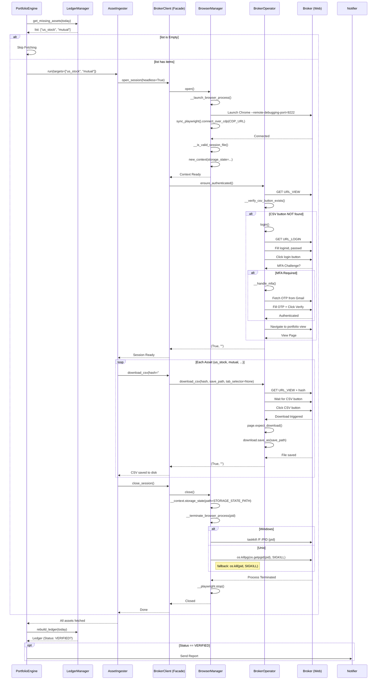
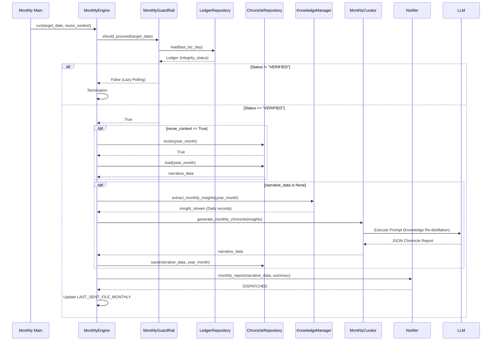

# Part 5: Advanced Implementation Details & Appendix

## 1. V4 Collection-Primary Implementation

v4.2 で追加された実装単位と責務の一覧。

| ファイル | 責務 |
| :--- | :--- |
| `src/domain/ledger_schema.py` | `ShadowLedger` / `ShadowAssetRecord` を定義し、合計額と資産行の整合を検証する |
| `src/domain/universal_ingester.py` | `market_units.csv` と `external_assets.json` を読み込み、`data/v4_shadow_ledger.json` を生成する（`diff_pct / wtd_pct / mtd_pct / ytd_pct` を算出） |
| `src/domain/collection_history_updater.py` | `market_units.csv` に定義された COLLECTION 資産の価格・FX履歴を yfinance 等から取得し、`data/collection/history/` へマージ・保存する |
| `scripts/dev/run_shadow_ingester.py` | Universal Ingester の単独実行・観測用スクリプト |
| `legacy/v3/src/app/broker_auditor.py` | Broker 取得と差分比較を監査層に隔離し、例外を Warning へ縮退する |
| `src/domain/shadow_ledger_adapter.py` | `ShadowLedger` を既存 `MarketCurator` が扱える Legacy Ledger 互換へ変換する（`total_wtd` と資産 `wtd` を含む） |
| `src/app/v4_engine.py` | v4日次のオーケストレーション。Canonical Ledger、Audit、AI、Render、Dispatch を接続する |
| `src/app/entrypoints/v4_daily_main.py` | v4標準日次 CLI |
| `src/app/renderer/v4_view_models.py` | `V4MonolithicViewModel` と `V4LedgerRowViewModel` を定義する。`V4LedgerRowViewModel` の `day_detail_line` フィールドは `asset_class = "US_STOCK"` の資産（静的外部資産を除く）の USD 評価額と FX キャプションを格納する。`pricing_status=STALE` の資産は `fmt_day_pct`（DAY 表示文字列）に `source_date` の月/日注記（例: `+1.23% (6/10)`）を付与する |
| `src/app/renderer/v4_content_renderer.py` | `v4_monolithic.html` をレンダリングするファサード |
| `src/app/renderer/templates/v4_monolithic.html` | Monolithic Scroll テンプレート（Appraisal は条件表示） |

### 1.1 Universal Ingester Calculation Rules

| 入力 | 対象 | 評価額計算 |
| :--- | :--- | :--- |
| `market_units.csv` | 投資信託 (`MUTUAL_FUNDS`) | `基準価額 / 10000 * units` |
| `market_units.csv` | 株式等 | `price * units * fx_rate` |
| `market_units.csv` | コモディティ | `oz建て価格 * fx_rate / 31.1034768 * units` |
| `market_units.csv` | FX helper row | 評価資産としては出力せず、USD建て換算の補助に使う |
| `external_assets.json` | 現金・外部資産 | `amount` をそのまま `current_value_jpy` にする |

`external_assets.json` は対象月 `YYYY-MM` のキーを優先し、存在しない場合は `default` キーへフォールバックする。`items` 配列以外は空配列として扱い、壊れた値は0へ安全化する。

### 1.2 V4 Test Coverage

v4.2 追加範囲は次のユニットテストで観測する。

| テスト | 対象 |
| :--- | :--- |
| `tests/unit/test_universal_ingester.py` | Dual Input SSOT、価格計算、外部資産マージ |
| `tests/unit/test_ledger_schema.py` | `ShadowLedger` の合計検証 |
| `legacy/v3/tests/unit/test_broker_auditor.py` | Broker監査の成功・縮退 |
| `tests/unit/test_shadow_ledger_adapter.py` | Legacy Ledger 互換変換 |
| `tests/unit/test_v4_engine.py` | v4日次オーケストレーション |
| `tests/unit/test_v4_renderer.py` | Monolithic Renderer / ViewModel |

---

## 2. Advanced Acquisition Logic (取得ロジック詳細)

アセットごとの外科的取得（Surgical Strike）の内部挙動です。

### 2.1 Execution Phases (執行フェーズ)

**Phase 1: Demand Sensing (需要予測)**
`PortfolioEngine` は `LedgerManager` に「今日の調達リスト」を問い合わせます。

***Logic***: 各アセット（`us_stock`, `mutual` 等）について、以下の判定を行います。
1. `archive/` 内の最新行の日付は `target_date` と一致するか？
2. その行は `Freshness Guard`（有意な変動）をクリアしているか？

***Output***: 上記を満たさない（＝未取得または古い）アセットの論理名リスト（例: `['us_stock.csv', 'mutual.csv']`）。

**Phase 2: Surgical Strike (外科的取得)**
`AssetIngester` は、渡されたリストが空でない場合のみ `BrokerClient` を起動します。

***Targeting***: リストに含まれるアセットに対応する URL Hash（`#DAILY.GOODS.ALL.4001` 等）のみを順次訪問し、CSVをダウンロードします。

***Optimization***: 不要な画面遷移（TOP画面待機等）を極力スキップし、Deep Link で直行します。

**Phase 3: Incremental Verification (漸進的検証)**
取得完了後、`LedgerManager` は即座に JSON をリビルドし、ステータスを再評価します。

***遷移例***: `STAGNANT` (朝イチ) → 米国株取得 → `ADJUSTED` (一部更新) → 投信取得 → **`VERIFIED` (完成)**。

### 2.2 Component Responsibilities (コンポーネント責務)

| モジュール | 責務 |
| :--- | :--- |
| **LedgerManager** | **[司令塔]**: アセットごとの鮮度を個別鑑定し、不足リストを作成するメソッド `get_missing_assets(target_date)` を実装。 |
| **AssetIngester** | **[執行者]**: 引数で `target_assets` を受け取り、`BROKER_ASSET_MAP` をフィルタリングして取得ループを回す。 |
| **BrowserManager** | **[Infrastructure]**: ブラウザプロセス・Playwright接続を管理。ドメイン知識なし。Session State (Cookie) の永続化・復元を担当。 |
| **BrokerOperator** | **[Domain Logic]**: Broker サイト固有の操作。ログイン、MFA、CSV取得。セレクタ定義の集約。エラーを `Tuple[bool, BrokerError]` で返却。ナビゲーション完了の待機は `click() + wait_for_load_state("load")` を使用し、クロスドメインリダイレクトチェーンの最終着地を保証する。 |
| **BrokerClient** | **[Facade]**: BrowserManager と BrokerOperator を統率。既存インターフェース (open_session, download_csv, close_session) を保持。エラーコードを子層から伝播させ、呼び出し元 (Engine) への利便性向上。 |

### 2.3 Sequence Diagram (シーケンス図 - Trinity Separation 対応)


### 2.4 GmailOTP — OTP 取得ロジック

MFA チャレンジ検知後、`GmailOTP.fetch_broker_code()` が IMAP で Gmail に接続し OTP を取得する。

| ステップ | 内容 |
| :--- | :--- |
| **1. IMAP 接続** | `imap.gmail.com` に SSL 接続。`IMAP_USER` / `IMAP_PASS` を使用 |
| **2. メール検索** | `FROM "no-reply@broker.example.com" SINCE {today}` で当日のメールを検索 |
| **3. 件名フィルタ** | 最新メールの件名に `ワンタイムパスワード` を含むか検証 |
| **4. 本文デコード** | `text/plain` パートを優先取得。charset は `get_content_charset()` で検出し、フォールバックは `iso-2022-jp` |
| **5. コード抽出** | `re.search(r'(?:ワンタイムパスワード\|認証コード).*?\b(\d{6})\b', body, re.DOTALL)` — `re.DOTALL` により CRLF 区切りの別行にコードが存在する場合も対応 |
| **6. クリーンアップ** | 取得成功後、メールに `\Seen` / `\Deleted` フラグを付与し `expunge()` で削除 |

リトライは最大 12 回、間隔 20 秒（デフォルト）。

---

## 3. Data Normalization Rules (データ正規化ルール)

データ取り込み時の文字列処理ルールです。

**Normalization (Sanitization)**
1. **NFKC Normalization**: `unicodedata.normalize('NFKC')` を適用し、全角英数（例: `ｉＦｒｅｅ`）を半角（`iFree`）へ統一します。
2. **Brand Respect**: ただし、カタカナやブランド固有の大文字小文字（CamelCase）は破壊せずに維持します。
3. **Tag Cleaning**: `[NISA]` タグや `(特定)` 等の付帯情報を正規表現で除去し、純粋な銘柄名をキーとして抽出します。

---

## 4. Reporting Implementation (レポート実装詳細)

Fortress Card (Zone 1) を構築するための具体的な HTML/CSS 構造です。
```html
<div style="margin-bottom: 60px;">
    <div style="margin-bottom: 32px;">
        <div style="font-size: 12px; color: #64748b; letter-spacing: 0.15em; margin-bottom: 8px; text-transform: uppercase;">Safe Ratio</div>
        <div style="font-size: 60px; font-weight: 100; color: #1e293b; line-height: 0.9; letter-spacing: -0.04em; margin-left: -2px;">
            52.4<span style="font-size: 24px; font-weight: 200; margin-left: 4px; color: #64748b;">%</span>
        </div>
    </div>

    <div style="margin-bottom: 40px; width: 100%;">
        <div style="width: 100%; height: 12px; background-color: #f1f5f9; overflow: hidden; display: flex;">
            <div style="width: 47.6%; display: flex;">
                <div style="width: 96%; background-color: #64748b;"></div>
                <div style="width: 4%; background-color: #c5a059;"></div> </div>
            <div style="width: 2px; background-color: #ffffff;"></div>
            <div style="width: 52.4%; background-color: #cbd5e1;"></div>
        </div>
    </div>

    <table border="0" cellpadding="0" cellspacing="0" style="width: 100%;">
        <tr>
            <td style="width: 33%; vertical-align: top;">
                <div style="font-size: 11px; color: #94a3b8; letter-spacing: 0.05em; text-transform: uppercase;">Exposure</div>
                <div style="font-size: 20px; color: #1e293b; font-weight: 200; margin-top: 4px;">7.6M</div>
            </td>
            <td style="width: 34%; vertical-align: top; text-align: center;">
                <div style="font-size: 11px; color: #94a3b8; letter-spacing: 0.05em; text-transform: uppercase;">Iron Bank</div>
                <div style="font-size: 20px; color: #1e293b; font-weight: 200; margin-top: 4px;">8.1M</div>
            </td>
            <td style="width: 33%; vertical-align: top; text-align: right;">
                <div style="font-size: 11px; color: #94a3b8; letter-spacing: 0.05em; text-transform: uppercase;">Damper</div>
                <div style="font-size: 20px; color: #1e293b; font-weight: 200; margin-top: 4px;">0.48x</div>
            </td>
        </tr>
    </table>
</div>
```

---

## 5. COLLECTION Acquisition Logic (COLLECTIONデータ取得詳細)

COLLECTION ドメインのデータ取得フローです。Broker の BrowserManager・PlaywrightSession を使用せず、GAS プロキシ経由のシンプルな HTTP リクエストを採用しています。

### 5.1 Fetch Flow (データ取得フロー)

| ステップ | モジュール | 内容 |
| :--- | :--- | :--- |
| **1. Config 読み込み** | CollectionEngine | `data/collection/market_units.csv` から name/units/csv_url を読み込む |
| **2. Direct Fetch** | CollectionEngine | 各 `fund["csv_url"]` へ `urllib.request.Request`（User-Agent: Mozilla/5.0、timeout: 30秒）で直接 HTTP GET（`-f` フラグ時のみ） |
| **3. CSV パース** | CollectionEngine | UTF-8 → Shift-JIS → CP932 の順でデコードを試行。`基準日`/`基準価額` 列を抽出する |
| **4. 履歴マージ** | CollectionEngine | `data/collection/history/{name}.csv` と連結し、日付重複を除去して保存する |
| **5. 指標計算** | CollectionEngine | 対象日以前の最新行から NAV を取得し、前日差・MTD・YTD を算出する |
| **6. ViewModel 構築** | CollectionEngine | `CollectionPositionViewModel` / `CollectionSummaryViewModel` を構築してレポートへ渡す |

### 5.2 CSV Encoding Strategy

MUFG・大和投資信託等の外部 CSV は Shift-JIS エンコードが多い。`CollectionEngine.__parse_nav_bytes()` は `utf-8 → shift-jis → cp932` の順にデコードを試み、各エンコードに対して `skiprows=[0, 1]` も組み合わせて試行する（CSV 先頭に余剰行がある場合に対応）。最初に成功したものを採用する。

日付フォーマットは `YYYYMMDD`（例: `20180131`）と `YYYY/MM/DD`（例: `2018/07/03`）の両方に対応し、いずれも `pd.to_datetime` でパースされる。

### 5.3 Metrics Calculation

| 指標 | 計算式 |
| :--- | :--- |
| **current_value** | `(NAV / 10000) × units` |
| **diff_pct (DAY)** | `(NAV - prev_NAV) / prev_NAV × 100` |
| **m_pct (MTD)** | `(NAV - 月初前最終NAV) / 月初前最終NAV × 100` |
| **y_pct (YTD)** | `(NAV - 前年末最終NAV) / 前年末最終NAV × 100`（前年末最終NAV = `df[df["基準日"] < 当年1月1日].iloc[-1]`） |

### 5.4 Fund Configuration Schema (market_units.csv スキーマ)

`data/collection/market_units.csv` の列定義。UTF-8 で保存し、`csv.DictReader` で読み込む。

| フィールド | 型 | 内容 | 必須 |
| :--- | :--- | :--- | :--- |
| **name** | str | ファンドの論理名。履歴ファイル名（`history/{name}.csv`）にも使用される | YES |
| **units** | int | 保有口数 | YES |
| **csv_url** | str | ファンド基準価額 CSV の直接 URL（`-f` フラグ時に HTTP GET する対象） | YES |

### 5.5 ViewModel Specifications (View 層定義)

#### CollectionSummaryViewModel

`CollectionEngine` がポートフォリオ全体の集計値から生成し、`CollectionRenderer` へ渡す。

| プロパティ | 型 | 内容 |
| :--- | :--- | :--- |
| `fmt_total_value` | str | 総評価額（カンマ区切り整数） |
| `fmt_total_diff` | str | 当日の総変動額（符号付きカンマ区切り整数） |
| `fmt_total_diff_pct` | str | 当日の総変動率（符号付き、小数点2桁 %） |
| `display_date` | str | レポート基準日（YYYY-MM-DD） |
| `total_diff_color` | str | `#c5a059`（プラス）/ `#64748b`（マイナス・ゼロ） |
| `day_color` | str | `#c5a059`（プラス）/ `#64748b`（マイナス・ゼロ）。COLLECTION の DAY 表示色に使用 |

**総変動率の計算式**: `total_diff_jpy / (total_value - total_diff_jpy) × 100`

#### CollectionPositionViewModel

ファンド 1 件ごとに生成される。

| プロパティ | 型 | 内容 |
| :--- | :--- | :--- |
| `name` | str | ファンド名（market_units.csv の `name`） |
| `fmt_value` | str | 評価額（カンマ区切り整数） |
| `fmt_diff_jpy` | str | 当日変動額（符号付きカンマ区切り整数） |
| `fmt_diff_pct` | str | 当日変動率（符号付き、小数点2桁 %） |
| `fmt_mtd` | str | MTD 変動率（符号付き、小数点2桁 %） |
| `fmt_ytd` | str | YTD 変動率（符号付き、小数点2桁 %） |
| `share_pct` | float | ポートフォリオ全体に占める比率（0〜100）。バーグラフの幅に使用 |
| `diff_color` | str | `#c5a059`（プラス）/ `#1e293b`（マイナス・ゼロ） |
| `day_color` | str | `#c5a059`（プラス）/ `#64748b`（マイナス・ゼロ）。COLLECTION の DAY 表示色に使用 |
| `day_is_positive` | bool | `diff_pct > 0` のとき True。テンプレート内で DAY ラベル色の分岐に使用 |

---

## 6. Historical Archives (歴史的アーカイブ)

初期プロトタイプ（MUFG/GAS連携）の要件です。

***[REQ-P-001] MUFG 基準価額の取得***: 三菱UFJアセットマネジメントの公開情報を参照し、特定のファンドの基準価額を取得すること。

***[REQ-P-002] GAS プロキシ利用***: 直接的なスクレイピング制限を回避するため、GAS URL を介したデータ取得をサポートすること。

***[REQ-P-006] プロト・トリニティ構造***: 後の「三位一体の分離」の原型となる、Config（設定）、Network（基盤）、Logic（計算）、Engine（執行）の分離を試行すること。

***[REQ-P-007] サンドボックス管理***: 本番データと隔離された `data/sandbox` ディレクトリで履歴（market_units.csv）を管理すること。

---

## 7. MarketDataFetcher — 市場データ取得ロジック

`src/infra/market_data.py` の `fetch_market_context(us_date_str)` が yfinance から市場コンテキストを取得する際の処理フロー（Rev. 5）。

### 7.1 Fetch & Normalization Pipeline

| ステップ | 処理 | 目的 |
| :--- | :--- | :--- |
| **1. Download** | `yf.download(tickers, start, end)` で14日分を一括取得 | S&P500 / NASDAQ100 / SOX / TNX / USD/JPY / VIX を同時取得 |
| **2. ffill()** | `raw["Close"].ffill()` | 非取引日（週末・祝日）の NaN を前営業日の終値で穴埋め |
| **3. dropna** | `.dropna(how="all")` | 全列が NaN のパディング行を除去 |
| **4. TZ 正規化** | `tz_convert(None)` → `normalize()` | tzaware インデックスを tz-naive の日付キー（00:00:00）に統一 |
| **5. 重複集約** | `groupby(index).last()` | 同一日付の複数行（FX のみ更新など）を最新行に集約 |
| **6. 未来日カット** | `close[index <= pd.to_datetime(us_date_str)]` | `us_date_str` より未来の先行データ行を強制除去 |

**Step 6 の必要性**: yfinance は為替（JPY=X）の最新足を `us_date_str` の翌日付で返すことがある。`ffill()` がこの翌日行に株価を伝播すると `curr == prev` となり、全銘柄の前日比が `0.00%` になるバグが発生する。ステップ 6 で当日超を強制カットすることで根絶する。

### 6.2 出力フォーマット

```
S&P500: +X.XX% | NASDAQ100: +X.XX% | SOX: +X.XX% | 米10年債: X.XX% (+X.XX) | USD/JPY: XXX.XX (+X.XX%) | VIX: XX.XX (+X.XX)
```

---

## 7. Monthly Chronicle Implementation (月次総括の実装詳細)

v3.0 より導入された、知見の蓄積からパラダイムシフトを読み解く月次総括エンジンの詳細仕様です。

### 6.1 Sequence Diagram: Monthly Execution Pipeline


### 6.2 Knowledge Re-distillation (ナレッジの再蒸留)

日次レポートで AI が鑑定したインサイト（`knowledge_bank.md`）は、月次処理において以下のプロセスで再構成されます。

1. **Extraction**: `KnowledgeManager` が対象月の日次 Insight（Theme, Overview, Insight）を時系列順に抽出します。
2. **Contextualizing**: 抽出された Insight ストリームを `MonthlyCurator` が受け取り、月間騰落率（MTD）や安全資産比率と結合します。
3. **Refinement**: AI が一ヶ月間のノイズを排し、構造的変化（パラダイムシフト）のみを歴史的観点から抽出。日次の「点」を繋ぎ、投資家が振り返るべき「線」の物語へと昇華させます。
