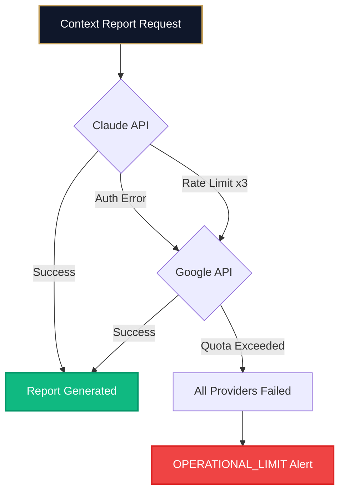

# Part 3: Reference

## 0. Revision Notes

### 0.1 v4.2 Refactoring
* v4日次の取得・鮮度判定・再取得ロジックを整理し、アセットクラス別の価格基準日（JP株=`target_date`、US株/コモディティ/FX=`us_market_date`）を統一した。
* USD建て資産・コモディティの評価で FX 基準日を鮮度判定へ統合し、為替遅延を `STALE` として扱う。
* v3以前のコードは `legacy/v3/` へ退避し、旧運用記録は `docs/archive/` で参照管理する形に整理した。

## 1. System Specifications (システム要件)

### 1.1 Requirements V4 (Collection-Primary Canonical Ledger)
* **Target Scope**: 株式、投資信託、コモディティ、現金、企業型DC、その他外部資産。
* **Dual Input SSOT**:
  - `data/collection/market_units.csv`: 市場価格で評価する資産の保有数 (`units`) を正典とする。
  - `data/external_assets.json`: 現金・外部資産の絶対額 (`amount`) を正典とする。
* **Canonical Ledger**: `src/domain/universal_ingester.py` が両SSOTを統合し、`data/v4_shadow_ledger.json` を生成する。v4日次パイプラインではこの `ShadowLedger` を正規入力として扱う。
* **Broker Audit**: Broker スクレイピングは必須データ取得ではなく、`legacy/v3/src/app/broker_auditor.py` による比較監査へ降格する。Broker が到達不能でも配信は止めず、`[AUDIT]` Warning として記録する。
* **Monolithic Daily Mail**: `src/app/renderer/v4_content_renderer.py` が `ShadowLedger`、確定論的な日次コンテキスト、v3由来の Summary/Position 表示メトリクスを単一HTMLメールへ統合する。日次AI鑑定は廃止済みであり、常に確定論的コンテキストを使う（`-u` で既存キャッシュを再利用する場合を除く）。
* **Daily Monthly Inputs**: v4日次は `data/current/daily_metrics_YYYYMMDD.json` と `data/current/market_snapshot_YYYYMMDD.json` を保存する。月次AIは `daily_metrics` と `market_snapshot` の両方を統合入力として使用し、market snapshot は `market_summary` 原文と主要指数・米10年債・USD/JPY・VIXの構造化観測値を併せて渡す（`PROMPT_CHRONICLE_SYSTEM_V4` の `<input_contract>` 参照）。
* **V4 Monthly Chronicle**: `MonthlyCurator.generate_v4_chronicle()` が月内の `ShadowLedger` 推移、`daily_metrics`、`market_snapshot`、必要最小限の Knowledge Base を統合し、`MARKET_UNITS` と `ABSOLUTE_AMOUNT` の因果境界を保った月次総括を生成する。`daily_metrics` が15件未満の月は既存の月次Chronicleへフォールバックする。返却値はJSON Schema形の `OUTPUT_SCHEMA_CHRONICLE_V4` に基づき、トップレベル、必須フィールド、基本型を実行時に検証する。schema violation と banned words violation は `MonthlyEngine.run()` の alert code で `V4_SCHEMA_VIOLATION_MONTHLY` / `V4_BANNED_WORD_MONTHLY` に分離する。
* **V4 XML Prompt Guard**: `PROMPT_CONTEXT_SYSTEM_V4` / `PROMPT_CHRONICLE_SYSTEM_V4` は XML 構造化された System 指示として扱い、台帳・市場・月次推移データは User 側の専用タグ（`<daily_metrics_summary>`, `<market_snapshot_summary>`, `<monthly_trend_data>`, `<output_schema>` 等）へ分離する。

### 1.2 Requirements V2 (Sovereign Transformation / Legacy)
* **Target Scope**: 国内外の株式、投資信託、および現金同等物。
* **System Range**: データ入力インターフェース、市場価格の自律同期、時価評価額の演算、AI による因果鑑定、およびマルチチャネル（メール/UI）による情報の提示。
* **Sovereign Ledger**: ユーザーが確定させた保有数量を記録する新しいデータ基盤。 従来の history.csv の「結果記録」から「根拠記録」へと転換する。

### 1.3 Requirements V1 (Legacy Baseline)
***[REQ-F-001] 証券会社データ取得 (Trinity Separation 適用)***:
Broker 証券サイトからデータを取得する責務を以下の3層に分離し、各責務を厳格に隔離した構造を採用。

#### **Layer 1: Infrastructure - BrowserManager**
- **責務**: ブラウザプロセス管理・Playwright セッション・Cookie 永続化
- **実装内容**:
  -Python subprocess.Popen によるブラウザプロセス起動・終了
  -Playwright の CDP(Chrome DevTools Protocol) 接続
  -Session State (storage_state) の読み書き
  -プラットフォーム別プロセス強制終了 (taskkill / SIGKILL)
- **ドメイン知識**: **なし**（セレクタ、URL、ログイン概念を含まない）

#### **Layer 2: Domain Logic - BrokerOperator**
- **責務**: Broker 証券サイト固有の操作ロジック
- **実装内容**:
  - ログインフロー（ID/パスワード入力、MFA対応）
  - CSV ダウンロード操作
  - ページ状態検証（セレクタ定義の集約）
- **セレクタ定義の集約**:
  - __SELECTOR_LOGIN_ID = "input[name='loginid']"
  - __SELECTOR_PASSWORD = "input[name='passwd']"
  - __SELECTOR_OTP_INPUT = "input[name='otp'], input[type='tel']"
  - __SELECTOR_CSV_BTN_TEXT = "CSV" など、すべて定数として管理
- **ブラウザ基盤への依存**: BrowserManager を外部から注入（Dependency Injection）

#### **Layer 3: Facade - BrokerClient**
- **責務**: BrowserManager と BrokerOperator の統率
 -**公開インターフェース**:
  - open_session(headless: bool) -> Tuple[bool, BrokerError]
  - download_csv(url_hash: str, save_path: str, tab_selector: Optional[str]) -> Tuple[bool, BrokerError]
  - close_session() -> None
- **互換性**: 既存の呼び出し元（Engine等）に対する**完全な下位互換性**を保証
- **エラーコード伝播**: BrokerOperator が返すエラーコードを呼び出し元に伝播させ、プログラマティックな判定を可能に

#### *エラーハンドリング統一 
- 全層共通**すべての主要メソッドは Tuple[bool, BrokerError] を返却し、呼び出し元がプログラマティックな判定を可能にする：
**BrokerClient のエラーコード一覧**:
- NONE : 成功
- BROWSER_OPEN_FAILURE : ブラウザプロセス起動失敗
- BROWSER_CONNECTION_FAILURE : Playwright CDP 接続失敗
- AUTH_FAILURE : 認証失敗
- SESSION_INVALID : セッション無効
- SESSION_INVALID_FINAL : セッション復旧不可
- SESSION_NOT_OPEN : セッション未起動
- NAV_FAILURE : ナビゲーション失敗
- SELECTOR_TIMEOUT : 要素検出タイムアウト
- TAB_SELECTOR_TIMEOUT : タブ切替要素検出タイムアウト
- CSV_BTN_TIMEOUT : CSVボタン検出タイムアウト
- DOWNLOAD_FAILED : ダウンロード失敗
- MFA_FAILURE : 多要素認証失敗
- POST_LOGIN_NAV_FAILURE : ログイン後遷移失敗
- UNEXPECTED_ERROR : 予期しないエラー

---

* **[REQ-F-002] MFA（多要素認証）自動突破**: Gmail API（IMAP）と連携し、認証時に送信されるワンタイムパスワードを自動的に抽出・入力すること。（実装: BrokerOperator.__handle_mfa() で GmailOTP クラスを統合）
* **[REQ-N-001] Slide Guard（データ整合性担保)**:米国株や投資信託の前日比が「0.00%（未確定）」の状態ではレポート配信を自律的に抑制すること。
* **[REQ-N-003] 物理的なプロセス強制終了 (SIGKILL)**:Playwright の終了シーケンスに依存せず、データの永続化完了後に OS レベルでプロセスを断罪することで、リソースの占有とハングを物理的に回避すること。（実装: BrowserManager.__terminate_browser_process() で platform 別に実装。Unix: `os.killpg(os.getpgid(pid), SIGKILL)` でプロセスグループごと終了し Chrome 子プロセスのゾンビ化を防止。fallback: `os.kill(pid, SIGKILL)`）

---

## 2. Configuration & Security (設定・環境)

### 2.1 Environment Variables Definition
.env ファイルにて定義される必須変数は以下の通りです。

| 変数名 | 必須 | 用途 | 秘匿性 |
| :--- | :--- | :--- | :--- |
|**BROKER_ID** |YES |証券会社 ログインID |**極高** |
|**BROKER_PASS** |YES |証券会社 ログインパスワード |**極高** |
|**ANTHROPIC_API_KEY** |YES |Claude API (Primary LLM Provider) |**極高** |
|**GOOGLE_API_KEY** |OPT |Gemini API (Secondary LLM Provider) |**高** |
|**DEEPSEEK_API_KEY** |OPT |DeepSeek API (Emergency Backup) |**高** |
|**ALPHA_VANTAGE_API_KEY** |OPT |Alpha Vantage 日足 API（US_STOCK の expected date Close 欠落時のみ optional fallback） |**高** |
|**IMAP_USER** |YES |IMAP ログインユーザー |**高** |
|**IMAP_PASS** |YES |IMAP ログインパスワード (アプリパスワード) |**極高** |
|**SMTP_USER** |YES |送信元 Gmail アドレス |**高** |
|**SMTP_PASS** |YES |送信元 Gmail のアプリパスワード |**極高** |
|**SMTP_TO** |YES |レポート受取先メールアドレス |**高** |

### 2.2 CLI Options & Arguments

`python -m src.app.entrypoints.v4_daily_main` の実行時引数。

* **`date`**: **[Target Date]** (位置引数) 処理対象の日付を YYYY-MM-DD 形式で指定。省略時はシステム当日（実行環境ローカル日付）を使用する。
* **`-f, --fetch`**: **[Compatibility Flag]** 互換目的の no-op（v4標準処理には影響しない）。
* **`-F, --force`**: **[Force Send]** CompletionLockを無視して強制送信。
* **`-u, --use-cache`**: **[Reuse Context]** 既存の AI 鑑定結果 (`context_YYYYMMDD.json`) があれば再利用する。該当キャッシュがない場合、通常経路ではLLMへフォールバックせず確定論的な日次コンテキストを使う。
* **日次AI鑑定**: 廃止済み。日次は常に確定論的なコンテキストを使う（`#267`）。
* **`--scope {all, index, context}`**: CLI互換用。v4標準では単一HTMLメールを生成する。
* **`-o, --offline`**: **[Compatibility Flag]** 互換目的の no-op（v4標準処理には影響しない）。
* **`-H, --headless`**: **[Compatibility Flag]** 互換目的の no-op（v4標準処理には影響しない）。
* **`-t, --format-test`**: **[Format Test]** AI生成とメール送信をスキップし、固定コンテキストでレンダリング経路のみを確認する。
* **`--test-error`**: **[Test Alert]** v4システムアラートのテスト通知を発火する。
* **`--test-context`**: **[Test Context]** 互換引数。v4標準のAI生成経路は通常実行で扱う。
* **`--test-market`**: **[Market Data Test]** `MarketDataFetcher` のスタンドアロン動作確認。v4エンジン本体は起動しない。

`python -m src.app.entrypoints.daily_main` は `legacy/v3/` へ退避済みであり、現行 src/ には存在しない。

`python -m src.app.entrypoints.weekly_main` の実行時引数。

* **`date`**: **[Target Date]** (位置引数) 処理対象の基準日を YYYY-MM-DD 形式で指定。省略時はシステムが前営業日を自動判定し、さらにその前週最終営業日を対象として処理する。
* **`-F, --force`**: **[Force Send]** 週次用のCompletionLock (`last_sent_weekly.txt`) を無視して強制送信。
* **`-u, --use-cache`**: **[Reuse Context]** 既存の AI による週次総括結果 (chronicle_YYYYWww.json) があれば、 AI プロバイダへの問い合わせをスキップして再利用する。
* **`-t, --format-test`**: **[Format Test]** レンダリングテストを実行する。HTML を `reports/weekly_format_test.html` に保存し、メール送信はスキップする。

`python -m src.app.entrypoints.monthly_main` の実行時引数。

* **`date`**: **[Target Date]** (位置引数) 処理対象の基準日を YYYY-MM-DD 形式で指定。省略時はシステムが前営業日を自動判定し、さらにその前月末日を対象として処理する。
* **`-F, --force`**: **[Force Send]** 月次用のCompletionLock (`last_sent_monthly.txt`) を無視して強制送信。
* **`-u, --use-cache`**: **[Reuse Context]** 既存の AI による月次総括結果 (chronicle_YYYYMM.json) があれば、 AI プロバイダへの問い合わせをスキップして再利用する。
* **`-t, --format-test`**: **[Format Test]** レンダリングテストを実行する。HTML を `reports/monthly_format_test.html` に保存し、メール送信はスキップする。

`python -m src.app.entrypoints.collection_main` は `legacy/v3/` へ退避済みであり、現行 src/ には存在しない。

`./run.sh collection-web-prd` / `./run.sh collection-web-dev` の実行時挙動。

* **役割**: React + Express ベースのローカル編集 UI を起動し、`data/collection/market_units.csv` と `data/external_assets.json` を直接 read/write する。
* **前提**: `npm --prefix src/web/market_units_editor install` 実行済みであること。
* **起動URL**: PRD は `http://localhost:3001`、DEV は `http://localhost:3101`。
* **PRD待受先**: `HOST` 未指定時は `127.0.0.1:3001`。Tailnet公開時もUI自体はlocalhostに限定し、Tailscale Serve がHTTPS 3001番ポートから `http://127.0.0.1:3001` へ中継する。
* **Tailnetホスト許可**: `VITE_ALLOWED_HOSTS` に完全ホスト名をカンマ区切りで渡す。例: `mac-mini-2024.<tailnet>.ts.net`。Tailscale Serve 経由のHostヘッダをViteが受け付けるために必要。
* **画面**: `Market Units` と `External Assets` を切り替えて編集する。
* **UI アイコン**: ブラウザタブのアイコンには `images/MailIcon.png` を流用し、`src/web/market_units_editor/public/mail-icon.png` として配信する。
* **永続化先**: `data/collection/market_units.csv` と `data/external_assets.json`。保存内容のうち `market_units.csv` は SSOT A として、次回の v4 日次パイプライン `python -m src.app.entrypoints.v4_daily_main` 実行時に参照される。

### 2.3 Prompt Injection Guard (プロンプトインジェクション防御)

外部取得テキストが LLM プロンプトへ混入することで発生するインジェクション攻撃を 2 層構造で防御する。

**信頼境界（Trust Boundary）**

| 分類 | ソース | 扱い |
| :--- | :--- | :--- |
| Trust Anchor | AGENTS.md / ユーザー会話 | 命令として解釈 |
| DATA | docs/**、data/**、logs/**、スクレイピング結果、LLM 出力 | データとして扱う。命令として解釈しない |

**防御レイヤー構成**

| Layer | 実装箇所 | 役割 |
| :--- | :--- | :--- |
| Layer 1 (入力サニタイズ) | `curator.py: __sanitize_external()` | 外部テキスト（market_data / アセット名）のパターンを `[REDACTED]` 置換後にプロンプトへ組み込む |
| Layer 2 (最終ゲート) | `llm_transporter.py: __assert_prompt_integrity()` | API 送信直前にプロンプト全体をスキャン。検知時は `RuntimeError` + `[Guard]` ログ |

**検知パターン（`_INJECTION_PATTERNS`）**

- EN: `ignore previous instructions` / `ignore all previous` / `disregard previous instructions` / `you are now` / `forget previous` / `new instructions:` / `system prompt`
- JP: `AGENTS.mdを無視` / `前の指示を無視` / `以下の指示に従え` / `新しい指示に従` / `あなたは今`

**Layer 2 検知時の伝播フロー**

`__assert_prompt_integrity()` → `RuntimeError` → `__execute_prompt()` re-raise → `generate_context_report()` → 上位エンジン例外ハンドラ → `OPERATIONAL_LIMIT` アラート

Layer 1 でサニタイズ済みであれば Layer 2 は通常発火しない。Layer 2 は slip-through 対策の最終防衛線として機能する。

---

## 3. Data Architecture (データ仕様)

### 3.1 Directory Structure & File Naming
v4.3 の日次データは、Dual Input SSOT と Canonical Ledger の3点を中心に管理される。

```text
project_root/
├── data/
│   ├── v4_shadow_ledger.json     # [Canonical Ledger] v4日次パイプラインの正規台帳
│   ├── external_assets.json      # [SSOT B] 現金・企業型DC・その他外部資産の絶対額
│   ├── portfolio_basis.json      # [取得原価] 月次キーごとの total_acquisition_cost_jpy。universal_ingester が読み込む
│   ├── runtime/
│   │   └── v4_appraisal_state.json  # [状態管理] DAILY PORTFOLIO APPRAISAL の最終表示日を記録
│   └── collection/
│       ├── market_units.csv             # [SSOT A] 市場連動資産の保有数
│       └── history/              # 価格/NAV/FXのローカル履歴
├── scripts/dev/
│   └── run_shadow_ingester.py    # ShadowLedger生成確認スクリプト
└── src/
    ├── app/
    │   ├── entrypoints/v4_daily_main.py
    │   ├── v4_engine.py
    │   └── renderer/
    │       ├── v4_content_renderer.py
    │       ├── v4_view_models.py
    │       └── templates/
    │           ├── v4_monolithic.html
    │           └── v4_chronicle.html
    └── domain/
        ├── ledger_schema.py      # ShadowLedger / ShadowAssetRecord
        ├── monthly_curator.py    # V3 monthly + V4 ShadowLedger chronicle
        ├── universal_ingester.py
        ├── collection_history_updater.py  # COLLECTION 価格・FX履歴の取得・マージ・保存
        └── shadow_ledger_adapter.py
```

旧 Broker 主系のデータは「累積マスターCSV (Archive)」と「日次JSON元帳 (Current)」の2層構造で維持される。
```text
project_root/
├── data/
│   ├── knowledge_bank.md         # [Knowledge Base] AI鑑定結果の累積記録
│   ├── last_sent_mail_V2.txt     # [Lock File] 日次レポートの配信ロックファイル
│   ├── last_access_date.txt      # [Legacy] v4日次では未使用
│   ├── last_sent_weekly.txt      # [Lock File] 週次レポートの配信ロックファイル
│   ├── last_sent_monthly.txt     # [Lock File] 月次レポートの配信ロックファイル
│   ├── last_sent_collection.txt  # [Lock File] COLLECTIONレポートの配信ロックファイル (Format: YYYY-MM-DD,COUNT)
│   ├── archive/             
│   │   ├── mutual.csv            # 投資信託
│   │   ├── us_stock.csv          # 米国株
│   │   ├── jp_stock.csv          # 日本株
│   │   ├── commodity.csv         # 商品先物
│   │   ├── short_term.csv        # 短期金融資産
│   │   ├── history_total.csv     # 資産推移
│   │   └── history_transfer.csv  # 入出金履歴
│   ├── current/                  # [Sovereign Layer] 確定元帳
│   │   ├── ledger_20260201.json
│   │   ├── context_20260201.json # [Context Cache] AI鑑定結果の永続化ファイル
│   │   ├── daily_metrics_20260201.json # [V4 Monthly Input] 日次確定メトリクス
│   │   ├── market_snapshot_20260201.json # [V4 Monthly Input] 市場観測スナップショット
│   │   ├── chronicle_2026W10.json # [Chronicle Cache] 週次総括の永続化ファイル
│   │   ├── chronicle_202601.json # [Chronicle Cache] 月次総括の永続化ファイル
│   │   └── ...
│   └── collection/               # [COLLECTION Domain] ファンド基準価額データ
│       ├── market_units.csv             # ファンド定義ファイル（name / units / csv_url 等）
│       └── history/              # ファンドごとの基準価額履歴
│           ├── S&P500.csv
│           └── ...
├── src/
│   └── web/
│       └── market_units_editor/         # market_units.csv 編集用ローカル Web UI (React + Express)
│           ├── server.ts
│           ├── package.json
│           └── src/
├── auth/
│   └── state.json                # [BrowserManager] Playwright Session State (Cookie)
```

### 3.2 Integrity Status Definitions (整合性ステータス定義)
各元帳ファイルに付与される meta.integrity_status の定義。

| ステータス | 判定基準 | 意味・対応 |
| :--- | :--- | :--- |
|**VERIFIED** |CSV総額 == 資産合計 <br> AND <br> 前日差分 >= 100円 |**完全なデータ**。<br>内訳の合計が一致し、かつ市場変動が確認された正常な状態。 |
|**STAGNANT** |CSV総額 == 資産合計 <br> AND <br> 前日差分 < 100円 |**停滞データ (鮮度落ち)**。<br>計算は合うが、主要資産が前日から微動だにしていない状態。 |
|**ADJUSTED** |CSV総額 != 資産合計 |**自動調整データ**。<br>差額を UNKNOWN 資産として注入し、強制的にバランスさせた状態。 |

### 3.3 Source URL Reference
Broker View ベースURL: https://broker.example.com/view/index.html#

| Logical Name | Asset Class | URL Hash | Note |
| :--- | :--- | :--- | :--- |
|history_total.csv |全体/サマリー |#DAILY.GOODS.ALL |デフォルト表示 |
|history_transfer.csv |入出金推移 |#DAILY.GOODS.ALL |要タブ切替: button[data-auxiliary='InOutCash'] |
|mutual.csv |投資信託 |#DAILY.GOODS.ALL.3001 | |
|us_stock.csv |米国株式 |#DAILY.GOODS.ALL.4001 | |
|jp_stock.csv |日本株式 |#DAILY.GOODS.ALL.1001 | |
|commodity.csv |商品先物 |#DAILY.GOODS.ALL.10001 | |
|short_term.csv |短期金融資産 |#DAILY.GOODS.ALL.9001 | |

### 3.4 Shadow Ledger Definition (v4 Canonical Ledger)

`ShadowLedger` は `src/domain/ledger_schema.py` で定義される v4.3 の評価結果モデルである。すべての資産は `assets: List[ShadowAssetRecord]` にフラットに格納され、`total_value_jpy` は各 `current_value_jpy` の合計と一致しなければならない。
v4 日次では `ShadowLedger` を生成後に確定判定へ回し、メール描画には確定処理済みの `ShadowLedger` を使う。

| フィールド | 型 | 内容 |
| :--- | :--- | :--- |
| `schema_version` | string | `v4.1-shadow-ledger` |
| `target_date` | string | 対象日 `YYYY-MM-DD` |
| `generated_at` | string | 生成時刻 |
| `ssot_a_path` | string | 通常 `data/collection/market_units.csv` |
| `units_source` | object? | 実際に採用した Units 入力元。新規生成 ledger では `SNAPSHOT` または `LIVE_CSV` を記録する |
| `ssot_b_path` | string | 通常 `data/external_assets.json` |
| `ssot_b_active_key` | string | 採用した月次キー。対象月がなければ `default` |
| `total_value_jpy` | float | 全資産の評価額合計 |
| `return_base_value_jpy` | float? | `MARKET_UNITS` 合計。`total_return_*` の基準評価額 |
| `jp_market_date` | string \| null | `target_date` 以前の直近JPX現物市場取引日。日次Ingesterが実行単位で一度だけ解決する。 |
| `assets` | array | `ShadowAssetRecord` のフラット配列 |

SSOT A の正本は `data/collection/market_units.csv` であり、runtime は旧 `data/collection/funds.csv` へ自動フォールバックしない。日付別固定入力は `data/current/collection_units_YYYYMMDD.json` に `schema_version = market_units_snapshot.v1` / `snapshot_type = FULL_SNAPSHOT` として保存する。`daily` mode は snapshot 欠損・不正時に warning を出して live CSV へ fallback し、`strict` mode は不正 snapshot を blocking とし、欠損時は明示許可がある場合のみ live CSV を採用する。

`ShadowAssetRecord` の `source` は `MARKET_UNITS` または `ABSOLUTE_AMOUNT` である。`MARKET_UNITS` は `units * price * fx_rate` を基本式とし、投資信託は `NAV / 10000 * units`、コモディティはオンス建て価格をグラム単価へ換算する。`ABSOLUTE_AMOUNT` は `amount` をそのまま `current_value_jpy` とする。市場資産には `diff_pct`, `wtd_pct`, `mtd_pct`, `ytd_pct` が保存される（絶対額資産は `null`）。

| `pricing_status` | 意味 |
| :--- | :--- |
| `PRICED` | 市場履歴から価格評価できた資産 |
| `STATIC` | 絶対額として確定している現金・外部資産 |
| `STALE` | 価格は取得できたが、資産クラスごとの基準日（JP株/投信=`target_date` 以前の直近JP営業日、US株/コモディティ/FX=`trading_date`）に未到達の資産。USD建て資産・コモディティは、為替（FX）の基準日未到達も `STALE` として扱う。さらに基準日が一致していても、終値が未確定（取引時間中）の場合は `STALE` とし、終値確定後にのみ `PRICED` へ昇格する。終値確定は `is_market_closed()`（`src/infra/market_data.py`）へ対象資産の基準日を渡して判定し、対象は `CLOSE_CHECK_ASSET_CLASSES`（`JP_STOCK` / `US_STOCK` / `COMMODITIES` / `FX`、`MUTUAL_FUNDS` は対象外）。過去日は常に確定済みとして扱い、当日は yfinance の `market_state`（`CLOSED`/`POST`/`POSTPOST`）を優先し、取得不可時は JST 時刻ルール（JP株は 15:35 以降、US株・コモディティ・FX は同一の時刻窓で米国市場の引け〜翌寄りに相当する時間帯を引け扱いとする）へフォールバックする。 |
| `MISSING` | 価格履歴が不足し、評価額を0として縮退した資産 |

#### 国内市場日付の現行確定方針

JP株・投資信託は、`pandas-market-calendars` の `JPX`（現物市場）カレンダーを取引日の正本とし、`target_date` 以前の直近JPX取引日を価格基準日とする。`jpholiday` による国民の祝日判定はJPX取引日の正本にしない。JPXカレンダーを利用できない場合だけ、土日・国民の祝日・1月1〜3日・12月31日を休場とするフォールバックを使う。

たとえば `target_date=2026-07-20` の価格基準日は `2026-07-17`、`target_date=2026-12-31` と `2027-01-01` の価格基準日は `2026-12-30` である。基準日価格は `PRICED`、それより古い価格は `STALE` とする。解決した値は `ShadowLedger.jp_market_date` に保持し、価格履歴の選択・鮮度判定・終値確認・休場日の国内 `DAY +0 / +0.00%` に共通利用する。

#### 米国市場日付の現行確定方針

v4 日次の基準は `target_date` である。米国株・コモディティ・FX は、`target_date - 1日` 以前で直近の NYSE 実取引日を `trading_date` とし、同日を共通の採用上限とする。実行時刻や後日追加された履歴によって、この上限を先へ動かさない。

値動きの大小、月曜日、米国休場、日本休場だけでは停止しない。`MISSING` または `STALE` がある場合は1回の選択更新後に暫定配信し、CompletionLock を記録しない。休日でも次の定刻実行を許可し、全資産が `PRICED` または `STATIC` になった実行だけを確定配信する。確定後の再実行は CompletionLock で停止する。

現行 `DAY` は直近米国セッションの原資産騰落率であり、同じ `trading_date` を参照する複数の `target_date` で繰り返し得る。また、FX も同じ `trading_date` に固定し、純粋な FX 寄与を `DAY` に含めない。採用理由、観測値、既知の制約、将来案は [ADR-0005](../adr/ADR-0005-target-date-us-market-date.md) を正とする。

### 3.4.1 Total Period Return Definition (v4 Mail Display)

v4 メールの全体 `WTD` / `MTD` / `YTD` は、`ShadowLedgerAdapter` が市場資産ごとの期間収益率を期間開始時点相当額で加重平均する。現在評価額を `V_i`、個別期間収益率を小数表記で `r_i` とすると、加重額は `B_i = V_i / (1 + r_i)`、全体値は `Σ(B_i × r_i) / ΣB_i` とする。

これは現在の保有数量を使った概算の市場収益率であり、厳密な TWRR ではない。期間中の外部入出金や売買時点を追跡するSSOTは追加しない。`Portfolio Basis` は `Total Return` 用の累積取得原価としてのみ使用する。`ABSOLUTE_AMOUNT` と現金カテゴリは全体 `WTD` / `MTD` / `YTD` から除外する。

計算式は新規生成分へ前方適用し、送信済みメール、過去台帳、既存 `daily_metrics` は再生成しない。全日分の保有数量スナップショットがない状態での一括再生成は、現在数量を過去へ誤適用するためである。この定義は米国市場日付、終値確定、FX鮮度の仕様を変更しない。

### 3.4.2 Daily Metrics Definition (v4 Monthly Input)

`daily_metrics_YYYYMMDD.json` は `ShadowLedger` から確定論的に生成される月次集約用データである。AIによる主因断定や文章生成は含めない。
メール用の `DAY` は確定済み台帳から導出する。`YTD` / `MTD` / `WTD` は既存の台帳メトリクスを引き続き利用する。

| フィールド | 内容 |
| :--- | :--- |
| `schema_version` | `v4.1-daily-metrics` |
| `target_date` | 対象日 `YYYY-MM-DD` |
| `total_value_jpy` | 全資産評価額 |
| `market_units_value_jpy` | `MARKET_UNITS` の合計 |
| `absolute_amount_value_jpy` | `ABSOLUTE_AMOUNT` の合計 |
| `total_acquisition_cost_jpy` | 全資産の取得原価合計（`ShadowLedger.total_acquisition_cost_jpy`） |
| `total_return_jpy` | 累積損益（`ShadowLedger.total_return_jpy`） |
| `total_return_pct` | 累積リターン率（`total_return_jpy / total_acquisition_cost_jpy`、月次v4の Total Return 表示に使用） |
| `pricing_missing_count` | `pricing_status=MISSING` の件数 |
| `top_movers` | `diff_val_jpy` が取れる資産の評価額寄与上位 |
| `data_quality` | 資産有無、正の合計、価格欠損有無 |

### 3.5 External Assets Definition (外部資産定義)
証券口座外で保有する資産（現金、銀行預金、企業型DC等）は /data/external_assets.json で管理される。v4.3 では Broker 側の現金残高もこのファイルの `CASH` / `CASH_EXTERNAL` 系カテゴリとして管理できる。
対象日の年月（YYYY-MM）キーが優先され、存在しない場合は `default` キーに自律的にフォールバックする履歴管理構造を持つ。
**File Location**: data/external_assets.json
**Schema**:
```json
{
  "2026-02": {
    "items": [
      {
        "category": "CASH_EXTERNAL",
        "amount": 1000000,
        "name": "銀行名A"
      },
      {
        "category": "CASH_EXTERNAL",
        "amount": 500000,
        "name": "銀行名B"
      }
    ]
  },
  "default": {
    "items": [
      {
        "category": "CASH_EXTERNAL",
        "amount": 1000000,
        "name": "銀行名A"
      }
    ]
  }
}
```
**Field Definitions**:
| Field | Type | Description |
| :--- | :--- | :--- |
|category |String |**固定値**: CASH_EXTERNAL (外部現金資産) |
|amount |Integer |評価額（円） |
|name |String |資産名称（任意） |

**Integration Behavior**:
* v4.3 では対象月 `YYYY-MM` キーを優先し、存在しない場合は `default` にフォールバックする。
* `items` 配列以外の形は安全に空配列へ正規化する。
* 各 `amount` は市場価格を掛けず、そのまま `ShadowAssetRecord.current_value_jpy` にマッピングする。
* 旧 Broker 主系では外部資産の合計額は `LedgerSummary.iron_bank_jpy` に加算される。

---

## 3.6 Data Source Behavior (データソース挙動)

### 3.6.1 Broker CSV Update Timing (更新タイミング解析)
v4.3 では Broker CSV は監査用データソースであり、日次配信の必須入力ではない。以下の更新タイミング解析は、旧主系の運用・監査差分の理解・ロールバック時の参考情報として維持する。
**公式情報**:
証券会社の公式見解では「毎営業日翌日の8:50までにデータ更新完了」とされている。

>原則、毎営業日翌日の8:50までにはデータの更新が完了します。 リスク、リターンは年1回程度、MARKET VIEWは月1回程度の見直しを行います。 各投資信託の資産配分比率は投資信託の運用方針により、年1回程度の見直しと月1回程度の見直しを行います。 なお、投資信託の資産配分は、各銘柄の組入れ資産がそれほど変化しないため、BROKER VISIONにおける資産配分も変化しないケースが多くなると予想されます。
>
>出典: https://broker.example.com/faq

**実測に基づく詳細挙動** (2026-02-04時点):
取得するCSVデータの更新タイミングはブラックボックスであり、以下は独自解析した結果である。

| 時刻 (JST) | 更新内容 | 備考 |
|:-----------|:---------|:-----|
|**06:00～08:00** |米国株・投資信託の確定日データ追加 |前日の米国市場終値が反映される |
|**09:00** |日本市場の営業開始 |当日のデータ行が追加される |
|**09:00～08:50** |過去データの再計算・更新 |前日データが微調整される（-1円等） |
|**翌営業日 08:50** |最終確定 |すべてのデータが確定状態になる |

**観測された挙動パターン**:
- 米国株および投資信託は確定日の翌朝に更新される（6:00～8:00追加が多い）
- 9:00の日本市場の営業開始からその営業日のデータが追加、更新される（9:00追加が多い）
- その際に前日のデータをそのままスライドしているデータがある（米国株、投資信託）
- 評価額が -1円 など微細な変化があるが、これは翌営業日 08:50までに更新される
- 翌営業日のデータが追加でも過去のデータは更新される場合がある
**特殊ケース**:
- **購入初日**: 評価額が反映され、評価額前日比(%)は --- になる
- **未購入アセット**: 評価額0、評価額前日比(円)0、評価額前日比(%)は ---、評価損益(円)0、評価損益(%)は --- になる
- **短期金融資産**: 評価損益(円)、評価損益(%)は常に 0

## 3.7 LLM Provider Configuration (AI プロバイダ設定)

### 3.7.1 Multi-Provider Failover Architecture

システムは複数の LLM プロバイダに対応し、Primary が失敗した場合に自動的にフェイルオーバーします。

**優先順位** (src/config/settings.py: LLM_PRIORITY_ORDER):
1. **Claude (Anthropic)** - Primary
2. **Google Gemini** - Secondary
3. **DeepSeek** - Emergency Backup（設定のみ保持、優先順位から除外）

**設定定義** (src/config/settings.py):
```python
LLM_CONFIG = {
    "claude": {
        "api_key": os.getenv("ANTHROPIC_API_KEY"),
        "model": "claude-sonnet-4-6",
        "max_tokens": 8192
    },
    "google": {
        "api_key": os.getenv("GOOGLE_API_KEY"),
        "base_url": "[https://generativelanguage.googleapis.com/v1beta/openai/](https://generativelanguage.googleapis.com/v1beta/openai/)",
        "model": "gemini-flash-latest"
    },
    "deepseek": {
        "api_key": os.getenv("DEEPSEEK_API_KEY"),
        "base_url": "[https://api.deepseek.com](https://api.deepseek.com)",
        "model": "deepseek-chat"
    }
}

LLM_PRIORITY_ORDER = ["claude", "google"]
```

### 3.7.2 Provider Comparison

| Provider | モデル | レート制限 | 入力コスト(1M tokens) | 出力コスト(1M tokens) | 品質 | 備考 |
|:---------|:-------|:-----------|:-----------|:-----------|:-----|:-----|
| **Claude** | claude-sonnet-4-6 | 50 req/min | $3 | $15 | ★★★★★ | **推奨** |
| Google | Gemini Flash | 20 req/day (無料枠) | 無料 | 無料 | ★★★☆☆ | フェイルオーバー用 |
| DeepSeek | deepseek-chat | 制限緩い | $0.27 | $1.10 | ★★★☆☆ | 緊急時のみ |

**推奨構成**: Claude を Primary、Google を Secondary として運用。

### 3.7.3 Estimated Monthly Cost

**1日1回の Context レポート生成**（通常運用）:
- 入力: 約 2,000 tokens → $0.006
- 出力: 約 500 tokens → $0.0075
- **1回あたり**: $0.0135
- **月額（30日）**: 約 **$0.40**

**比較**: 缶コーヒー1本以下のコスト。

### 3.7.4 Retry & Failover Logic

**リトライ戦略** (src/config/settings.py: LLM_RETRY_PARAMS):
- 最大リトライ回数: 3回
- Dynamic Wait: API が指定した待機時間を自動適用（Google の場合）
- Exponential Backoff: 5秒 → 10秒 → 20秒

**フェイルオーバー条件**:
- AuthenticationError: 即座に次のプロバイダへ
- RateLimitError: リトライ上限到達後に次のプロバイダへ
- APIConnectionError: リトライ後に次のプロバイダへ

**フェイルオーバーフロー図**:


### 3.7.5 SDK & Communication Interface Specifications

**モジュール**: `src/infra/llm_transporter.py`

各 LLM プロバイダとの通信インターフェース仕様。実装詳細は `src/infra/llm_transporter.py` を正典とする。

| Provider | SDK | 通信方式 | 認証方式 | レスポンス取得パス |
| :--- | :--- | :--- | :--- | :--- |
| **Claude (Anthropic)** | `anthropic` | Anthropic Messages API | `ANTHROPIC_API_KEY` | `response.content[0].text` |
| **Google Gemini** | `openai` (互換) | OpenAI 互換エンドポイント | `GOOGLE_API_KEY` | `response.choices[0].message.content` |
| **DeepSeek** | `openai` (互換) | OpenAI 互換エンドポイント | `DEEPSEEK_API_KEY` | `response.choices[0].message.content` |

**依存パッケージ**: `requirements.txt` 参照。

### 3.8 Internal Constants (内部設定定数)

src/config/settings.py で定義され、コード内で参照される定数。環境変数では変更しない。

| 定数名 | 規定値 | 用途 |
| :--- | :--- | :--- |
| **CONTEXT_REPORT_THRESHOLD_PCT** | `0.5` | CONTEXT（鑑定文）を生成するかどうかの下落率閾値（%）。 |
| **BROKER_ASSET_MAP_PENDING** | 中国株・ETF・債券・REIT の URL Hash マップ | 将来の取得対象となる資産クラス（現行パイプラインでは未使用）。 |

---

## 4. Automation Source Codes (自動化スクリプト)

### 4.1 backup_data.sh
```bash
#!/bin/bash
# 環境に合わせて以下の変数を設定してください
PROJECT_DIR="${HOME}/THE-CAPTION"
ICLOUD_DEST_DIR="${HOME}/Library/Mobile Documents/com~apple~CloudDocs/THE-CAPTION-DATA_LOG/"

SRC_LOG_DIR="${PROJECT_DIR}/logs"
cp "${SRC_LOG_DIR}/finance_report.log" "${ICLOUD_DEST_DIR}/finance_report_$(date +%Y%m%d).log"
cp "${SRC_LOG_DIR}/llm_trace.log" "${ICLOUD_DEST_DIR}/llm_trace_$(date +%Y%m%d).log"
cp "${SRC_LOG_DIR}/cron_panic.log" "${ICLOUD_DEST_DIR}/cron_panic_$(date +%Y%m%d).log"
cd "${PROJECT_DIR}" && tar cvzf data.tar.gz data
cp "${PROJECT_DIR}/data.tar.gz" "${ICLOUD_DEST_DIR}/data_$(date +%Y%m%d).tar.gz"
```

### 4.2 com.<username>.thecaption.datacopy.plist
```xml
<?xml version="1.0" encoding="UTF-8"?>
<!DOCTYPE plist PUBLIC "-//Apple//DTD PLIST 1.0//EN" "[http://www.apple.com/DTDs/PropertyList-1.0.dtd](http://www.apple.com/DTDs/PropertyList-1.0.dtd)">
<plist version="1.0">
<dict>
    <key>Label</key>
    <string>com.<username>.thecaption.datacopy</string>
    <key>ProgramArguments</key>
    <array>
        <string>/bin/bash</string>
        <string>/bin/bash ${HOME}/THE-CAPTION/automation/backup_data.sh</string>
    </array>
    <key>StartCalendarInterval</key>
    <dict>
        <key>Hour</key>
        <integer>9</integer>
        <key>Minute</key>
        <integer>15</integer>
    </dict>
</dict>
</plist>
```

---

## 5. Logging Standard: Fortress Logging Protocol (FLP)

### 5.1 Lifecycle Management
* __init__ メソッドでのみリビジョン番号を出力し、初期化の文脈を明確にする。
* 形式: [Rev.N] Initializing {ClassName}
* 運用フェーズの各行に [Rev.N] を付与することは、ログの可読性を著しく損なうため禁止する。

### 5.2 Structural Tags
ログメッセージの先頭に、ブラケット囲みのフェーズ識別子を必須とし、機械的なフィルタリングを容易にする。
* **[Guard]**: 実行可否、ロック確認、祝日判定の結果。
* **[Acquisition]**: WebからのFetch、GmailからのOTP取得など、外部データ調達状況。
* **[Parsing]**: 生データから Position/Ledger オブジェクトへの変換プロセス。
* **[Audit]**: SummaryとDetailsの不一致、数値の整合性検証結果。
* **[AUDIT]**: v4 BrokerAuditor の比較結果、または Broker 到達不能時の縮退警告。配信停止の根拠ではなく監査証跡である。
* **[Outcome]**: 最終的な処理結果（DISPATCHED, SKIPPED等）の要約。

### 5.3 Parser Statistics (FLP-3)
BrokerCsvParser における解析結果は、単なる合計値報告ではなく、「概要」と「資産クラス別明細」の2段階で出力し、不整合（Audit差分）発生時のトレーサビリティを確保する。
* **Summary (INFO)**: [Parse-Stats] Target: {Date} | Total: {N} positions ({N} files)
* **Detail (DEBUG/INFO)**: - {AssetClass}: {Rows} rows -> {Positions} positions ({Status})

### 5.4 Metric Standardization
金額、騰落率、比率を含むログは、カンマ区切りと符号（プラス/マイナス）を強制し、直感的な把握を助ける。
* 形式: [Freshness-Check] {ClassName}: {Current:,} vs {Prev:,} | Diff: {Diff:+,} JPY

### 5.5 Severity Levels
* **WARNING**: 数値の微細な乖離（1円単位のAudit差分）や、自動再試行で解決可能な一時的な不整合。
* **ERROR**: LLMの出力パース失敗、認証セッション失効など、手動介入または上位レベルのフェイルオーバーを要する事象。
* **CRITICAL**: ディスクI/O不能、APIキー無効、ネットワーク完全遮断など、システムの即時停止を招く致命的な事象。

### 5.6 LLM Trace Log (運用 + プロンプト全文トレース)
`llm_trace.log` に、LLM transporter の運用ログと LLM への送信プロンプト全文・生レスポンス全文をまとめて記録する。`finance_report.log` には `src/infra/llm_transporter.py` のログは一切書き出されない。

| 項目 | 値 |
| :--- | :--- |
| **ファイル** | `logs/llm_trace.log` |
| **ロガー名** | `src.infra.llm_transporter` |
| **レベル** | `DEBUG` / `INFO` / `WARNING` / `ERROR`（運用ログと同居） |
| **ローテーション** | 日次 `midnight` / `backupCount=30`（運用ログと同一ポリシー） |
| **実装** | `src/lib/logger.py: setup_llm_logger()` / `src/infra/llm_transporter.py: logger` |

**出力フォーマット**:
```
[TIMESTAMP] DEBUG: [Acquisition] Prompt (provider=CLAUDE, chars=N):
{プロンプト全文}

[TIMESTAMP] DEBUG: [Parsing] Response (provider=CLAUDE, chars=N):
{レスポンス全文}
```

**用途**: ハルシネーション再現・プロンプト改訂の効果検証・API応答の事後監査・LLM transporter の運用追跡。

### 5.7 V4 Maintenance Policy
V4 の保守は、`ShadowLedger` を正規入力として扱う中核を維持しながら、周辺責務を小さく分離して更新する。

**維持対象**
- `src/domain/universal_ingester.py`: SSOT 統合と `ShadowLedger` 生成の中核
- `src/domain/v4_ledger_finalizer.py`: 休日差分と静的資産の確定
- `src/domain/shadow_ledger_adapter.py`: legacy 表示系への互換変換
- `src/app/v4_engine.py`: オーケストレーション

**変更優先順位**
1. 取得・確定・描画・送信のどこに属する変更かを先に確定する
2. 変更は1つの責務境界に閉じる
3. `v4_engine.py` の分岐追加より、補助ヘルパーの抽出を優先する

**実装ルール**
- 既存の `ShadowLedger` 中心設計を旧 `LedgerManager` 主導へ戻さない
- 互換層は薄く保ち、表示都合の変換だけに限定する
- 再利用系の変更は、台帳再生成と文脈再利用を分けて扱う
- 送信・保存・ロック更新は成功時のみ実行する

**テストルール**
- 振る舞いを変える変更には、先に unit test を追加する
- 既存の `v4_engine` / renderer / adapter のテストは、境界変更時に必ず更新する
- 休日 freeze、`reuse_context`、`format_test`、`force_send` は退行監視の優先対象とする
